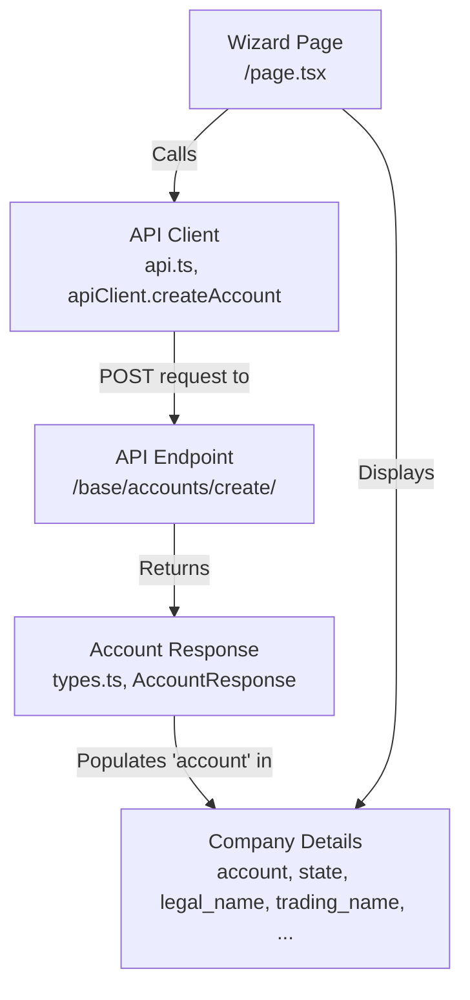

# Codebase Research Report

## Query
in my wizard /page.tsx, it should facilitate the picking of username in account under contact person and add it to the company details body which should be this structure

{
  "account": "josephs Ocheieng",
  "state": "PENDING", 
  "legal_name": "Acme Ltd",
  "trading_name": "Acme",
  "country_of_incorporation": "Kenya",
  "incorporation_registration_number": "REG123456",
  "registered_address": "123 Street, Nairobi",
  "operating_address": "456 Business Road",
  "company_email": "info@acme.com",
  "company_phone": "+254700000000",
  "tax_certificate": "KRA123456789",
  "industry_category": "Technology",
  "legal_entity_form": "Limited Liability",
  "website_url": "https://acme.com",
  "regulatory_license_info": "License ABC"
}

as of now I get the error account is not assigned

## Answer
### System Diagram



### Summary
The `AccountResponse` type definition includes both `id` and `username` fields. This confirms that the code in `wizard/page.tsx` is correctly attempting to access these fields from the API response.

Given this, the most likely cause of the "account is not assigned" error is that the API is *not actually returning* the `username` or `id` in the `AccountResponse`, despite their presence in the type definition. This could be due to a mismatch between the API's actual response and the defined type, or an error occurring within the API itself.

To verify this, you should:

1.  **Inspect the API response:** Use browser developer tools or server-side logging to examine the raw JSON response from the `apiClient.createAccount` call. Confirm whether the `username` and `id` fields are present and have values.
2.  **Check the API implementation:** If the `username` or `id` are missing from the API response, investigate the server-side code that handles the `/base/accounts/create/` endpoint to ensure it's correctly populating these fields in the response.

If the API is indeed not returning the expected data, you'll need to modify the API implementation to include the `username` and/or `id` in the `AccountResponse`.

If the API *is* returning the data, then the issue might be related to how the data is being handled in the `wizard/page.tsx` file. For example, there might be a timing issue where the `companyData` is being constructed before the `accountData` is fully populated. However, based on the current code, this is less likely.

Here's a Markdown report summarizing the findings:

```markdown
# CodeViz: Payment Processing Analysis

## Problem: "account is not assigned" error in wizard/page.tsx

The `account` field in the `companyData` object is not being populated correctly, resulting in an "account is not assigned" error.

## Analysis

1.  **Account Data Population:**
    -   The `account` field in `companyData` (file:onboarding-system/src/app/onboarding/wizard/page.tsx:245) is intended to be populated with `accountData.username || accountData.id`.
    -   `accountData` is populated by the `apiClient.createAccount(contactData)` API call (file:onboarding-system/src/app/onboarding/wizard/page.tsx:220).
    -   The response from the API call is directly assigned to `accountData` using `setAccountData(response)` (file:onboarding-system/src/app/onboarding/wizard/page.tsx:224).

2.  **API Definition:**
    -   `apiClient` and `createAccount` are defined in `onboarding-system/src/lib/api.ts`.
    -   The `createAccount` function is defined as:

        ```typescript
        async createAccount(data: ContactPersonData): Promise<AccountResponse> {
          return this.request<AccountResponse>("/base/accounts/create/", {
            method: "POST",
            body: JSON.stringify(data),
          })
        }
        ```

3.  **AccountResponse Type:**
    -   The `AccountResponse` type is defined in `onboarding-system/src/lib/types.ts` as:

        ```typescript
        export interface AccountResponse {
          id: string
          username: string
          email: string
          first_name: string
          last_name: string
        }
        ```

## Conclusion

The most likely cause of the error is that the API is not returning the `username` or `id` fields in the `AccountResponse`, despite their presence in the type definition.

## Recommendations

1.  **Inspect the API response:** Use browser developer tools or server-side logging to examine the raw JSON response from the `apiClient.createAccount` call.
2.  **Check the API implementation:** If the `username` or `id` are missing from the API response, investigate the server-side code that handles the `/base/accounts/create/` endpoint to ensure it's correctly populating these fields in the response.
```

## Walkthrough Steps

### 1. Problem Introduction: 'account is not assigned' Error
The user is encountering an 'account is not assigned' error in `wizard/page.tsx` when trying to populate the `account` field in the `companyData` object. The `account` field is intended to be populated with the `username` or `id` from the `accountData` object.

### 2. Tracing the Data Source: The `apiClient.createAccount` Call
The `accountData` is populated by the `apiClient.createAccount(contactData)` API call. The response from this API call is directly assigned to `accountData` using `setAccountData(response)`. This means the issue likely stems from the API response itself.

### 3. Examining the API Definition: `createAccount` Function
The `apiClient` and `createAccount` are defined in `api.ts`. The `createAccount` function makes a POST request to the `/base/accounts/create/` endpoint and expects an `AccountResponse`.

### 4. Verifying the `AccountResponse` Type Definition
The `AccountResponse` type is defined in `types.ts` and includes fields like `id`, `username`, `email`, `first_name`, and `last_name`. The problem arises if the API is not actually returning the `username` or `id` in its response, despite their presence in the type definition.

### 5. Identifying the Root Cause: Missing Data in API Response
The most likely cause of the error is that the API is not returning the `username` or `id` fields in the `AccountResponse`. To verify this, inspect the raw JSON response from the `apiClient.createAccount` call using browser developer tools or server-side logging. This will confirm whether the `username` and `id` fields are present and have values.

### 6. Troubleshooting the API Implementation
If the `username` or `id` are missing from the API response, investigate the server-side code that handles the `/base/accounts/create/` endpoint. Ensure that the server-side code is correctly populating these fields in the `AccountResponse` before sending it back to the client.

## Detailed Sub-Search Results

### 1. Extract the code block from wizard/page.tsx where the 'account' variable is defined or assigned, and also extract the code block where the 'company details' object is constructed. Show how the username from the contact person is being used to populate the 'account' field in the company details object.
Okay, here's the requested information from `wizard/page.tsx`:

*   **`account` variable definition/assignment:**

    ```typescript
    48 |   const [accountData, setAccountData] = useState<any>(null)
    ```

    (file:wizard/page.tsx:48) This line initializes the `accountData` state variable using `useState`. It will hold the account information retrieved from the API after creating the account in the first step.

*   **`company details` object construction:**

    ```typescript
    243 |           const companyData = {
    244 |             ...(formData[2] as CompanyDetailsData),\
    245 |             account: accountData.username || accountData.id, // Try username first, fallback to id
    246 |             state: "PENDING", // Default state
    247 |           }
    ```

    (file:wizard/page.tsx:243-247) This code block shows how the `companyData` object is constructed. It takes the data from the `CompanyDetailsForm` (formData[2]) and adds the `account` and `state` properties.

*   **How username from contact person is used to populate the 'account' field:**

    ```typescript
    245 |             account: accountData.username || accountData.id, // Try username first, fallback to id
    ```

    (file:wizard/page.tsx:245) This line shows that the `account` field in the `companyData` object is populated with the `username` property from the `accountData` object (which is obtained after creating the account using contact person data). If the `username` is not available, it falls back to using the `id` property.

### 2. Find the code in wizard/page.tsx where setAccountData is called and show the API call that populates accountData. Show how the response from the API call is used to set the value of accountData.
`setAccountData` is called on line 224: `setAccountData(response) (file:onboarding-system/src/app/onboarding/wizard/page.tsx:224)`.

The API call that populates `accountData` is `apiClient.createAccount(contactData)` (file:onboarding-system/src/app/onboarding/wizard/page.tsx:220). This call is made when the user clicks "Next" on the first step (Contact Person). The `contactData` is retrieved from the form data: `const contactData = formData[1] as ContactPersonData` (file:onboarding-system/src/app/onboarding/wizard/page.tsx:218).

The response from the API call is directly used to set the value of `accountData`: `setAccountData(response)` (file:onboarding-system/src/app/onboarding/wizard/page.tsx:224). The entire response object is stored in the `accountData` state.

### 3. Extract the definition of apiClient and the createAccount function from onboarding-system/src/lib/api.ts. Include the response type definition for createAccount.
Here's the requested information from `onboarding-system/src/lib/api.ts`:

*   **apiClient Definition:**

    ```typescript
    class ApiClient {
      private baseURL: string

      constructor(baseURL: string) {
        this.baseURL = baseURL
      }

      private async request<T>(endpoint: string, options: RequestInit = {}): Promise<T> {
        const url = `${this.baseURL}${endpoint}`

        const config: RequestInit = {
          headers: {
            "Content-Type": "application/json",
            Accept: "application/json",
            ...options.headers,
          },
          mode: "cors",
          credentials: "include",
          ...options,
        }

        try {
          console.log(
            `API Request: ${options.method || "GET"} ${url}`,
            config.body ? JSON.parse(config.body as string) : null,
          )

          const response = await fetch(url, config)

          // Handle empty responses
          let data
          try {
            data = await response.json()
          } catch (e) {
            data = {}
          }

          if (!response.ok) {
            console.error(`API Error: ${response.status}`, data)
            throw new Error(data.message || data.error || `HTTP error! status: ${response.status}`)
          }

          console.log(`API Response: ${url}`, data)

          // Handle Django API response format: { message, data, status }
          if (data && typeof data === "object" && "data" in data && data.status === "success") {
            return data.data as T
          }

          // Fallback to direct data if not in expected format
          return data
        } catch (error) {
          console.error("API request failed:", error)
          throw error
        }
      }

      // Step 1: Create Account
      async createAccount(data: ContactPersonData): Promise<AccountResponse> {
        return this.request<AccountResponse>("/base/accounts/create/", {
          method: "POST",
          body: JSON.stringify(data),
        })
      }
    ...
    }

    export const apiClient = new ApiClient(API_BASE_URL)
    ```

*   **createAccount Function Definition:**

    ```typescript
    async createAccount(data: ContactPersonData): Promise<AccountResponse> {
      return this.request<AccountResponse>("/base/accounts/create/", {
        method: "POST",
        body: JSON.stringify(data),
      })
    }
    ```

*   **AccountResponse Type Definition:**

    The `AccountResponse` type is imported from `"./types"` (file:onboarding-system/src/lib/api.ts:7).

### 4. Extract the definition of AccountResponse from onboarding-system/src/lib/types.ts
```text
export interface AccountResponse {
  id: string
  username: string
  email: string
  first_name: string
  last_name: string
}
(file:onboarding-system/src/lib/types.ts:157)
```

---
*Generated by [CodeViz.ai](https://codeviz.ai) on 6/26/2025, 9:46:39 AM*
